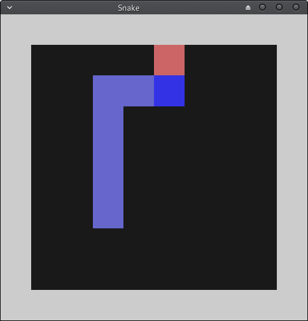

# NeuroEvolution Snake 

Game rendered with OpenGL textures. Neural networks trained with steady state genetic algorithm. After some iterations it scores even 20 points. Only neural network weights are modified. For better algorithm check [NEAT](http://nn.cs.utexas.edu/downloads/papers/stanley.ec02.pdf).

Dependencies:
- [GLFW](https://www.glfw.org/) - window creation
- [Eigen](http://eigen.tuxfamily.org/index.php?title=Main_Page) - matrix math
- [{fmt}](https://github.com/fmtlib/fmt) - better printing utilities

